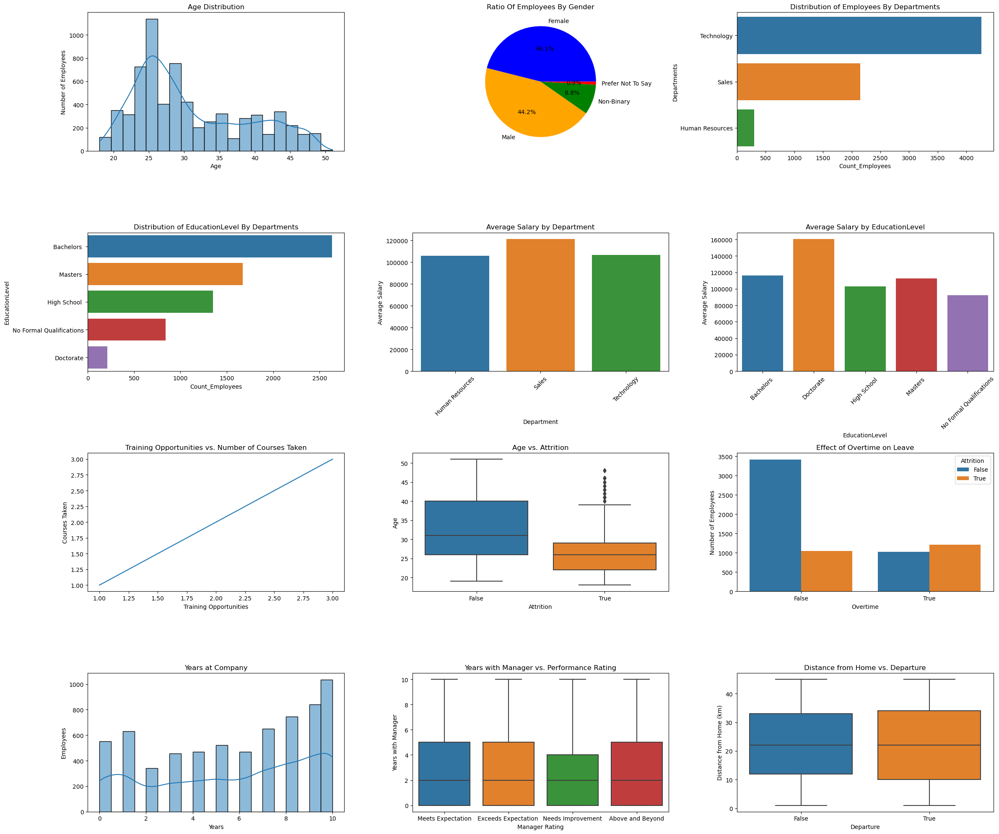

.. code:: ipython3

    import pandas as pd
    import numpy as np
    import matplotlib.pyplot as plt 
    import seaborn as sns

.. code:: ipython3

    df = pd.read_csv("FinalProject.csv")

.. code:: ipython3

    import matplotlib.pyplot as plt
    import seaborn as sns
    
    # Create a figure with a suitable size (4 rows x 3 columns)
    fig, axes = plt.subplots(4, 3, figsize=(24, 20))
    axes = axes.flatten() # Convert the grid to a list for easier handling
    
    # Age distribution of employees
    sns.histplot(df['Age'], bins=20, kde=True, ax=axes[0])
    axes[0].set_title("Age Distribution")
    axes[0].set_xlabel("Age")
    axes[0].set_ylabel("Number of Employees")
    
    # Percentage of employees by gender
    gender_counts = df["Gender"].value_counts()
    axes[1].pie(gender_counts, labels=gender_counts.index, autopct="%1.1f%%", colors=['blue', 'orange', 'green', 'red'])
    axes[1].set_title("Ratio Of Employees By Gender")
    
    # Distribution of Employees By Departments
    sns.countplot(y=df['Department'], order=df['Department'].value_counts().index, ax=axes[2])
    axes[2].set_title("Distribution of Employees By Departments")
    axes[2].set_xlabel("Count_Employees")
    axes[2].set_ylabel("Departments")
    
    # Distribution of Employees By Education Level
    sns.countplot(y=df['EducationLevel'], order=df['EducationLevel'].value_counts().index, ax=axes[3])
    axes[3].set_title("Distribution of EducationLevel By Departments")
    axes[3].set_xlabel("Count_Employees")
    axes[3].set_ylabel("EducationLevel")
    
    # Average Salary By Departments
    sns.barplot(x=df.groupby('Department')['Salary'].mean().index, y=df.groupby('Department')['Salary'].mean().values, ax=axes[4])
    axes[4].set_title("Average Salary by Department")
    axes[4].set_ylabel("Average Salary")
    axes[4].tick_params(axis='x', rotation=45)
    
    # Average Salary By Education Level
    sns.barplot(x=df.groupby('EducationLevel')['Salary'].mean().index, y=df.groupby('EducationLevel')['Salary'].mean().values, ax=axes[5])
    axes[5].set_title("Average Salary by EducationLevel")
    axes[5].set_xlabel("EducationLevel")
    axes[5].set_ylabel("Average Salary")
    axes[5].tick_params(axis='x', rotation=45)
    
    # Relationship between training opportunities and number of courses
    sns.lineplot(x=df['TrainingOpportunitiesWithinYear'], y=df['TrainingOpportunitiesWithinYear'], ax=axes[6])
    axes[6].set_title("Training Opportunities vs. Number of Courses Taken")
    axes[6].set_xlabel("Training Opportunities")
    axes[6].set_ylabel("Courses Taken")
    
    # Relationship between age and resignation rate
    sns.boxplot(x=df['Attrition'], y=df['Age'], ax=axes[7])
    axes[7].set_title("Age vs. Attrition")
    axes[7].set_xlabel("Attrition")
    axes[7].set_ylabel("Age")
    
    # Effect of overtime on resignation
    sns.countplot(x=df['OverTime'], hue=df['Attrition'], ax=axes[8])
    axes[8].set_title("Effect of Overtime on Leave")
    axes[8].set_xlabel("Overtime")
    axes[8].set_ylabel("Number of Employees")
    
    # Distribution of years of work in the company
    sns.histplot(df['YearsAtCompany'], bins=20, kde=True, ax=axes[9])
    axes[9].set_title("Years at Company")
    axes[9].set_xlabel("Years")
    axes[9].set_ylabel("Employees")
    
    # Relationship between manager rating and number of years working with him
    sns.boxplot(x=df['manager_rating'], y=df['YearsWithCurrManager'], ax=axes[10])
    axes[10].set_title("Years with Manager vs. Performance Rating")
    axes[10].set_xlabel("Manager Rating")
    axes[10].set_ylabel("Years with Manager")
    
    # Relationship between distance from home and resignation
    sns.boxplot(x=df['Attrition'], y=df['DistanceFromHome_KM'], ax=axes[11])
    axes[11].set_title("Distance from Home vs. Departure")
    axes[11].set_xlabel("Departure")
    axes[11].set_ylabel("Distance from Home (km)")
    
    # Improve ordering between charts
    plt.tight_layout()
    
    plt.show()

